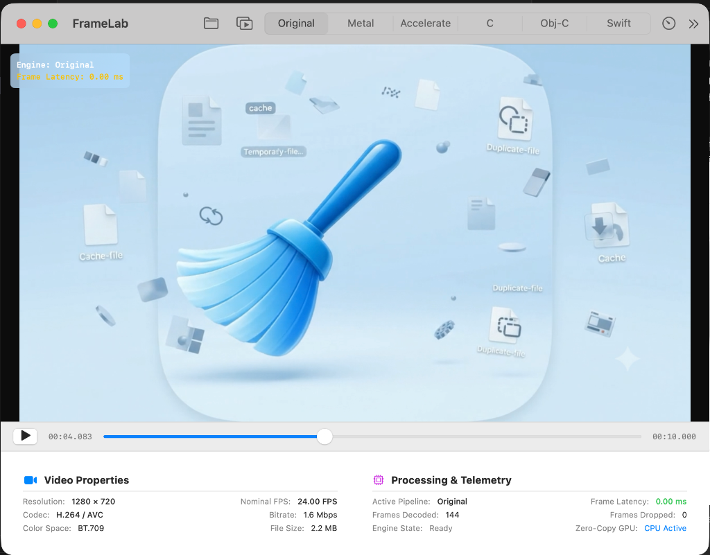
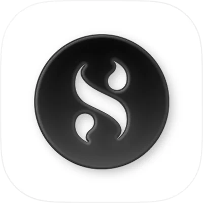
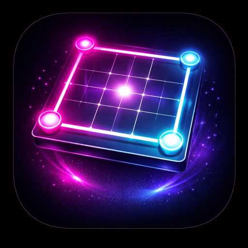
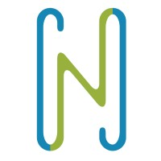
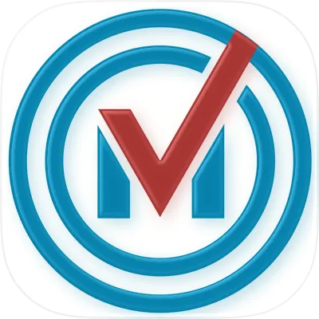
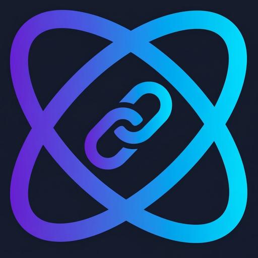
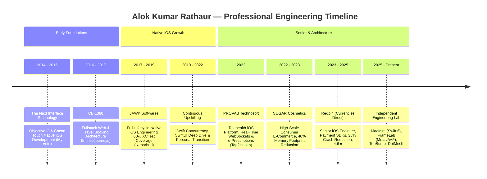

# Hi there, I'm Alok Kumar Rathaur 👋
### **Senior iOS Engineer & Apple Platform Architect**

  <b>8.3+ Years Experience • 7+ Years Native Apple Ecosystem</b> 
  <i>Architecting high-performance, crash-resilient iOS & macOS applications with Swift 6, SwiftUI, and modern concurrency.</i>

  
  
  
  
  

---

<table>
  <tr>
    <td width="72%" valign="top">
      <h3>👨‍💻 Executive Summary</h3>
      

        I am a <b>Senior iOS Engineer & Apple Platform Architect</b> with <b>8.3+ years</b> of engineering experience (7+ years dedicated native Apple ecosystem) architecting, developing, and shipping high-impact iOS and macOS applications across <b>Fintech, Consumer E-Commerce (100K+ MAU), Telehealth, and Native macOS Utilities</b>.
      

      

        Deep expertise in <b>Swift 6 & 5, SwiftUI, UIKit, AppKit, Swift Concurrency (async/await, Actors), Core Data, Combine, AVFoundation, Metal</b>, and enterprise <b>Payment SDKs</b> (Apple Pay, 3DS 2.0, PSD2 SCA). Proven track record implementing <b>MVVM-C, Clean Architecture, VIPER, and TCA</b> to build scalable, testable, and maintainable codebases.
      

      

        📍 <b>Location:</b> Kanpur, India • <i>Open to Global Relocation, Hybrid & Remote Roles</i> 
        🎯 <b>Current Focus:</b> Swift 6 Data-Race Safety, High-Performance macOS Utilities & Video Engineering
      

    </td>
    <td width="28%" align="center" valign="middle">
      
        
      
    </td>
  </tr>
</table>

---

### 🏆 Production Impact & Key Metrics

| Metric | Achievement | Impact & Context |
| :---: | :---: | :--- |
| ⏱️ | **8.3+ Years** | Professional software engineering with **7+ years** native Apple platform specialization |
| 📉 | **35% Crash Reduction** | Diagnosed and eliminated edge crashes via Xcode Instruments & telemetry at **Redpin** |
| ⚡ | **30% Faster Cold Launch** | Optimized launch sequence through lazy view hierarchy loading & binary size tuning |
| 🧠 | **40% Memory Optimization** | Purged critical retain cycles & memory leaks in a **100K+ MAU** e-commerce app |
| ⭐ | **4.6★ Rating** | Drove 22% MAU increase and lifted App Store rating from 4.3 to 4.6 stars |

---

## 🚀 Featured Shipped Products & Portfolio

### 🍎 Native Apple Ecosystem & macOS Utilities

<table>
  <tr>
    <td width="80" align="center">
      
    </td>
    <td>
      <b>MacMint — Storage Cleaner & Optimizer for macOS</b> &nbsp; <code>macOS 14+ (Sonoma & Sequoia)</code> 
      <i>Architected an itemized multi-category storage cleanup engine in Swift 6 & SwiftUI. Features 7-category deep clean (DerivedData, CocoaPods, Docker, Homebrew), VMware Fusion (.vmwarevm/.vmdk) virtual disk scanner, dual Sunburst & Treemap visualizers, and CleanerGuard zero-deletion safety sandbox.</i> 
      <b>Tech:</b> Swift 6, SwiftUI, AppKit, Swift Concurrency, Cloudflare Workers, Dodo Payments 
      🔗 <a href="https://getmacmint.store/"><b>getmacmint.store</b></a> • <a href="https://github.com/alokrathaur/MacMintMacApp"><b>GitHub Repo</b></a>
    </td>
  </tr>
  <tr>
    <td width="80" align="center">
      
    </td>
    <td>
      <b>FrameLab — High-Performance Apple Video Engineering Suite</b> &nbsp; <code>macOS & iOS</code> 
      <i>Video inspection, processing, and hardware benchmarking suite. Implements rational <code>CMTime</code> scrubbing, uncompressed <code>CMSampleBuffer</code>/<code>CVPixelBuffer</code> pipelines, custom Metal Shaders, Accelerate/vImage kernels, and C/Objective-C interop across platforms.</i> 
      <b>Tech:</b> Swift, SwiftUI, AVFoundation, Metal, Accelerate (vImage), Core Media, C/Obj-C Interop 
      🔗 <a href="https://testflight.apple.com/join/hfQEg5wB"><b>TestFlight Beta</b></a> • <a href="https://github.com/alokrathaur/FrameLab"><b>GitHub Repo</b></a>
    </td>
  </tr>
</table>

### 💼 Commercial & Enterprise Production Ships

<table>
  <tr>
    <td width="80" align="center">
      
    </td>
    <td>
      <b>Currencies Direct (Redpin) — International Money Transfer & FX</b> &nbsp; <code>Enterprise Fintech</code> 
      <i>Architected full-cycle iOS delivery using MVVM-C & Clean Architecture. Integrated enterprise Payment SDKs (Apple Pay, 3D Secure, PSD2 SCA) across European corridors. Cut production crashes by 35%, sped up cold launch by 30%, and drove rating from 4.3 to 4.6★.</i> 
      <b>Role:</b> Senior Software Engineer (iOS) &nbsp;|&nbsp; <b>Period:</b> Aug 2023 – Oct 2025 
      🔗 <a href="https://apps.apple.com/gb/app/currencies-direct/id1094746471"><b>App Store Link</b></a>
    </td>
  </tr>
  <tr>
    <td width="80" align="center">
      
    </td>
    <td>
      <b>SUGAR Cosmetics — Consumer E-Commerce iOS App</b> &nbsp; <code>100K+ Active Users</code> 
      <i>Engineered high-conversion checkout funnels, product catalogs, and interactive bag flows. Profiling via Xcode Instruments eliminated memory retain cycles, reducing footprint by 40% and binary size by 15%. Integrated Branch deep linking and WebEngage push campaigns.</i> 
      <b>Role:</b> Senior Software Engineer (iOS) &nbsp;|&nbsp; <b>Period:</b> Dec 2022 – Jul 2023 
      🔗 <a href="https://apps.apple.com/us/app/sugar-cosmetics/id1476501793"><b>App Store Link</b></a>
    </td>
  </tr>
  <tr>
    <td width="80" align="center">
      
    </td>
    <td>
      <b>DotMesh — Cyber-Neon Tactical Multiplayer Game</b> &nbsp; <code>iOS & Android</code> 
      <i>End-to-end product & technical ownership. Real-time multiplayer matchmaking with sub-second synchronization via Firebase, offline smart AI bot heuristics, cyber-neon UI animations, and StoreKit in-app subscriptions.</i> 
      <b>Tech:</b> React Native, Expo, TypeScript, Firebase Realtime DB, StoreKit, Google Play Billing 
      🔗 <a href="https://apps.apple.com/my/app/dotmesh-dots-boxes-game/id6761758144"><b>App Store</b></a> • <a href="https://play.google.com/store/apps/details?id=com.legendprixai.dotmesh"><b>Google Play</b></a>
    </td>
  </tr>
  <tr>
    <td width="80" align="center">
      
    </td>
    <td>
      <b>Tap2Health Pro — Telehealth & Doctor Consultation Platform</b> &nbsp; <code>Healthcare iOS</code> 
      <i>Engineered doctor-facing iOS app supporting real-time virtual consultations via WebSockets, multi-mode video/voice/chat, Trustgate digital signature e-prescriptions, and multi-stage medical credential verification.</i> 
      <b>Role:</b> Software Developer (iOS) &nbsp;|&nbsp; <b>Period:</b> Apr 2022 – Nov 2022 
      🔗 <a href="https://apps.apple.com/us/app/tap2health/id6446981899"><b>App Store Link</b></a>
    </td>
  </tr>
  <tr>
    <td width="80" align="center">
      
    </td>
    <td>
      <b>Neborhud — Residential Community iOS App</b> &nbsp; <code>5,000+ Active Residents</code> 
      <i>Built community iOS app from ground zero with events, polling, and real-time chat. Developed comprehensive XCTest suite achieving 60% code coverage, cutting regression defects by 30%.</i> 
      <b>Role:</b> Software Developer (iOS) &nbsp;|&nbsp; <b>Period:</b> May 2017 – Oct 2019 
      🔗 <a href="https://apps.apple.com/us/app/neborhud/id1241312755"><b>App Store Link</b></a>
    </td>
  </tr>
  <tr>
    <td width="80" align="center">
      
    </td>
    <td>
      <b>My Vote — Native iOS & Voting Portal</b> &nbsp; <code>Objective-C / Cocoa Touch</code> 
      <i>Developed native iOS client app using Objective-C and Cocoa Touch, maintaining a 95% defect-resolution rate across 3 client production releases.</i> 
      <b>Role:</b> Associate Software Developer (Web & iOS) &nbsp;|&nbsp; <b>Period:</b> Sep 2014 – Jul 2016 
      🔗 <a href="https://apps.apple.com/us/app/my-vote/id757649127"><b>App Store Link</b></a>
    </td>
  </tr>
</table>

### 🌐 SaaS & Web Engineering

<table>
  <tr>
    <td width="80" align="center">
      
    </td>
    <td>
      <b>TopBump — Pay-to-Rank SaaS & B2B Leaderboard Platform</b> 
      <i>High-concurrency ranking platform featuring a 65-category database hierarchy, live bidding leaderboards, swappable PaymentProvider abstraction layer, and Vitest test suites for transactional balancing.</i> 
      <b>Tech:</b> Next.js 16, React 19, TypeScript, Prisma, PostgreSQL, Tailwind CSS 
      🔗 <a href="https://topbump.lol"><b>topbump.lol</b></a> • <a href="https://github.com/alokrathaur/TopBump"><b>GitHub Repo</b></a>
    </td>
  </tr>
  <tr>
    <td width="80" align="center">
      
    </td>
    <td>
      <b>TinyOrbit URL — Developer URL Shortener & Telemetry Portal</b> 
      <i>High-performance URL shortener with real-time analytics dashboard, GeoIP geolocation mapping, JWT authentication, Google OAuth 2.0, and IP rate limiting.</i> 
      <b>Tech:</b> React 19, Vite, TypeScript, Node.js, Express, PostgreSQL, Docker 
      🔗 <a href="https://tiny-orbit-url.vercel.app/"><b>Live App</b></a> • <a href="https://github.com/alokrathaur/TinyOrbitUrl"><b>GitHub Repo</b></a>
    </td>
  </tr>
</table>

---

## 🛠️ Technical Competencies & Apple Arsenal

#### 📱 Apple Platforms & Core Frameworks

#### ⚡ Concurrency & Architecture Patterns

#### 💳 Payments, Security & Compliance

#### 🔬 Performance Profiling & Tooling

#### 🚀 DevOps, Build Systems & CI/CD

#### 🌐 Cross-Platform, Web & Fullstack

---

## 💼 Career Journey

---

## 📊 GitHub Insights & Statistics

  
  &nbsp;
  

  

---

## 🎓 Education & Certifications

- **Post Graduate Diploma in Advanced Computing (PG-DAC)** — *CDAC, IACSD Pune (71%)*
- **Bachelor of Technology (B.Tech) in Computer Science & Engineering** — *Allenhouse Institute of Technology, UPTU (71%)*
- **Certifications:** Preventing Financial Crime • Global Sanctions Compliance • Anti-Money Laundering (AML) • Anti-Bribery & Corruption (LRN) • Prompt Engineering (Udemy)

---

## 🤝 Let's Connect

I am actively open to **Senior iOS Engineer**, **Staff iOS Engineer**, and **Mobile Solutions Architect** opportunities worldwide (Relocation, Hybrid, or Remote).

  
  &nbsp;
  
  &nbsp;
  
  &nbsp;
  

  Crafted with precision & passion for the Apple ecosystem. © 2026 Alok Kumar Rathaur

